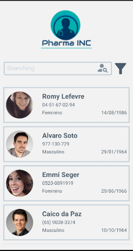

# Bem Vindo ao Pharma Inc React Native App Desafio front-end Coodesh

## Projeto desenvolvido com React Native + Expo

## Desafio site `https://lab.coodesh.com/public-challenges/front-end-challenge-2021`

## Tecnologias utilizadas

- React Native
- React Navigation
- ContextAPI
- Styled-components
- React Native Testing Library
- Randomuser.me API

## Instruções de Instalação

1. Clone o repositorio

`https://github.com/marcusjava/coodesh_mobile`

2. Instalação
   Pré-requisitos: NodeJS instalado `https://nodejs.org/en/`

- Expo CLI - `npm install --global expo-cli`
- Instalar dependencias - `expo install`

- Iniciar o projeto com expo start e abrir no emulador de sua preferencia

3. Executar projeto usando expo

- Instalar o Expo através da loja da Apple ou PlayStore
- Abrir o aplicativo no celular e escanear o QRCode deste site `https://expo.dev/@marcusreact/coodesh-mobile`
